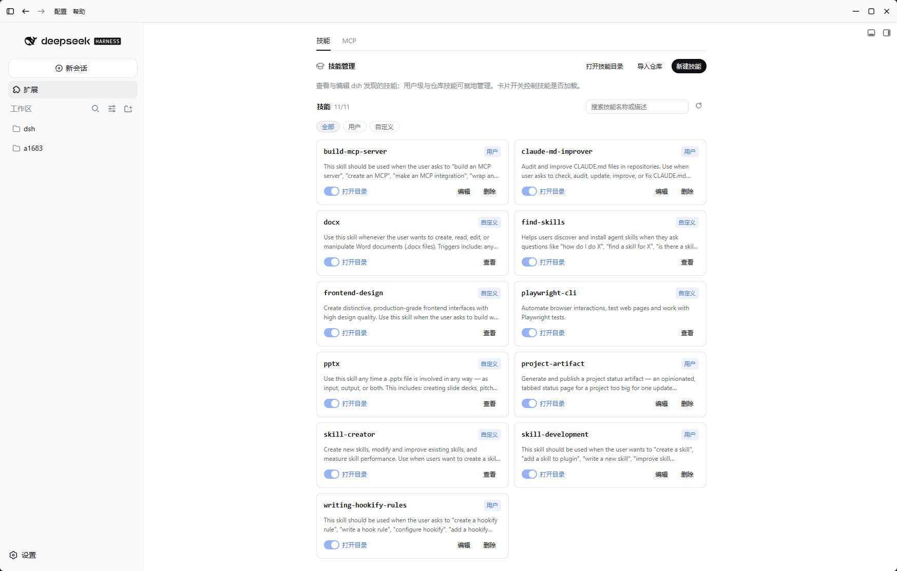

# dsh-tauri-plugins

为 [DeepSeek Harness](https://github.com/deepseek-ai/dsh) 提供 Tauri 桌面端能力的插件工作区。插件遵循 DSH 的 **host half / client half** 模型：宿主侧负责工具、路由和系统上下文，客户端负责 iframe 内的 UI 与消息桥接。



## 插件

| 包 | 说明 | 版本 |
| --- | --- | --- |
| [`dsh-tauri`](./packages/dsh-tauri) | Tauri 宿主导航栏与 DSH iframe 之间的消息桥 | `0.2.0` |
| [`dsh-tauri-ui`](./packages/dsh-tauri-ui) | Tauri 风格 UI，包括设置侧边栏 | `0.1.0` |
| [`dsh-tauri-worktree`](./packages/dsh-tauri-worktree) | 为会话创建隔离 Git worktree，并支持检出回本地 | `0.1.3` |
| [`dsh-tauri-panel`](./packages/dsh-tauri-panel) | Tauri 面板 UI 与 `panel.protocol` 宿主 | `0.0.0` |
| [`dsh-tauri-panel-extension`](./packages/dsh-tauri-panel-extension) | “扩展”面板：技能、技能仓库导入与 MCP 管理 | `0.0.0` |
| [`dsh-tauri-panel-placeholder`](./packages/dsh-tauri-panel-placeholder) | 面板占位实现，用于预留集成入口 | `0.0.0` |

`dsh-tauri-tsdown` 是工作区内部使用的 tsdown 配置包，不作为运行时插件发布。

## 开发

```bash

pnpm install
pnpm dev
pnpm build
pnpm test
pnpm typecheck
pnpm lint
```

运行单个包的测试：

```bash
pnpm --filter dsh-tauri-worktree test
```

## 设计约定

- 每个插件都导出宿主侧 `apply`，客户端入口位于 `src/client`。
- 客户端插件应通过稳定的 slot、locale 和服务注入点扩展 DSH，避免依赖生成的 CSS module 类名。
- 涉及 Git、文件系统或宿主 API 的能力只放在 host half；浏览器侧通过同源 HTTP 路由或消息协议访问。
- `checkout_worktree` 只在用户明确请求或批准后执行。

## 许可证

[MIT](./LICENSE.md) © [Hairyf](https://github.com/hairyf)
